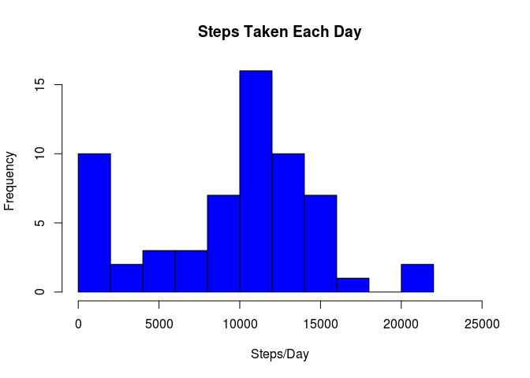
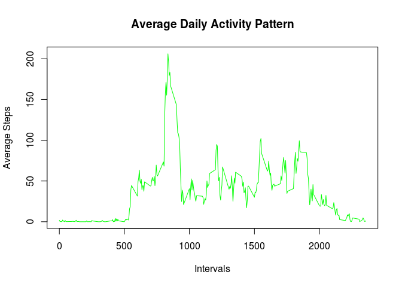
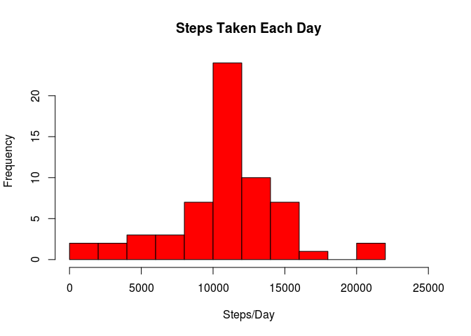
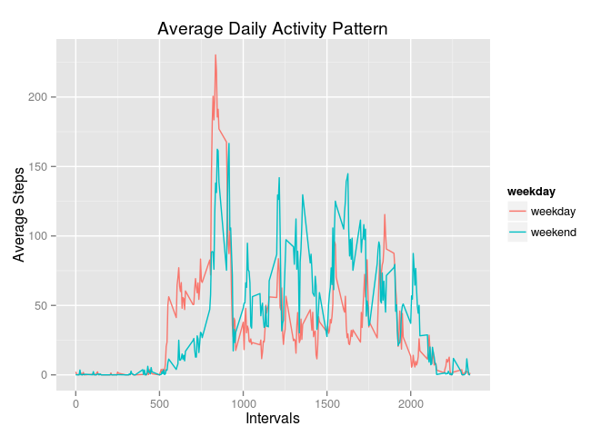

# Monitoring Steps
acarloto  
May 16, 2015  

### Introduction

This guided report was done to the Reproducible Research Course, hosted in Coursera. We had to analyse the data collected from an individual during two months. The data consists in the number of steps taken in 5 minute intervals each day.

### Loading and preprocessing the data

First, we had to load the data, look at it and made some minor transformations on it.


```r
# Load the data
data <- read.csv("data/activity.csv")

# Looking at the data
str(data)
```

```
## 'data.frame':	17568 obs. of  3 variables:
##  $ steps   : int  NA NA NA NA NA NA NA NA NA NA ...
##  $ date    : Factor w/ 61 levels "2012-10-01","2012-10-02",..: 1 1 1 1 1 1 1 1 1 1 ...
##  $ interval: int  0 5 10 15 20 25 30 35 40 45 ...
```

```r
head(data)
```

```
##   steps       date interval
## 1    NA 2012-10-01        0
## 2    NA 2012-10-01        5
## 3    NA 2012-10-01       10
## 4    NA 2012-10-01       15
## 5    NA 2012-10-01       20
## 6    NA 2012-10-01       25
```

We can see that we are dealing with a data frame with 17568 observations and 3 variables: steps (int) - the number of steps in each interval; date (Factor) and interval (int) - the id of each 5 min. interval. There are a considerable number of cells with NAs (we will deal with that later) and the format of the date variable is not the more appropriate.


```r
# Transform variable date from class "Factor" to class "Date"
library(lubridate)
data$date <- ymd(data$date)
```

## What is mean total number of steps taken per day?
 
For this work I will often manipulate the data in the format of data.table, which I find easier and faster than in the format of data frame, for many operations. In this first approach, I will not pay attention to the missing steps data, for now. 


```r
library(data.table)
```

```
## 
## Attaching package: 'data.table'
## 
## The following objects are masked from 'package:lubridate':
## 
##     hour, mday, month, quarter, wday, week, yday, year
```

```r
# Convert to data table
DT <- as.data.table(data)

# Calculate the sum of steps for each day
totalByDay <- DT[, .(sumDay = sum(na.omit(steps))), by = date ]
```


```r
# Make histogram
hist(totalByDay$sumDay, col = "blue", main = "Steps Taken Each Day", 
     xlab = "Steps/Day", breaks = 12, xlim = c(0, 25000))
```

 


```r
# View mean and median
summary(totalByDay)
```

```
##       date                sumDay     
##  Min.   :2012-10-01   Min.   :    0  
##  1st Qu.:2012-10-16   1st Qu.: 6778  
##  Median :2012-10-31   Median :10395  
##  Mean   :2012-10-31   Mean   : 9354  
##  3rd Qu.:2012-11-15   3rd Qu.:12811  
##  Max.   :2012-11-30   Max.   :21194
```

We can see that the distribution of steps per day have some resemblance with a normal distribution, but with gaps, a high % of days with 0 or very few steps (which probably is caused by a lot of missing data in those days) and a high variance. The mean (9354) is smallest than the median (10395), sign that the distribution is skewed to the left.

### What is the average daily activity pattern?

This kind of activity can be studied in a time serie of days, but perhaps is more interesting to know the daily activity pattern; how the number of steps in the 288 5 min. chunks varies along the day. Note that the intervals id do not correspond exactly with minutes, e.g. the id 55 (55 min.) is followed by the id 100 (1 h and 0 min.). So, the day beguins with interval 0 (0 min.) and ends with interval 2355 (23 h and 55 min.).


```r
# Calculate the mean of steps for each daily interval
meanByInterval <- DT[ , .(meanDay = mean(na.omit(steps))), by = interval ]
```


```r
# Make time series
plot(meanByInterval$interval, meanByInterval$meanDay, type = "l", col = "green",
     main = "Average Daily Activity Pattern", xlab = "Intervals", 
     ylab = "Average Steps")
```

 


```r
# Identify the daily interval with more steps, on average
intervalMax <- meanByInterval$interval[ meanByInterval$meanDay == 
                                          max(meanByInterval$meanDay)]
intervalMax
```

```
## [1] 835
```

As expected, the average number of steps decreases notably to the end of the day, reaching near zero values when, presumably, the person goes to bed, and stays that way till around 5 of the morning, when the person gets up and the number of steps beguins to increase. The peak of the day (~ 200 steps) is reached at interval 835 (8:35). We can speculate that at this time the person does some kind of voluntary (e.g. jogging) or involuntary exercise (e.g. runs to catch the train). By 10:00, this burst of activity is finished, and the average number of steps by interval remain stabilized throughout the day, oscillating between 50 and 100.

### Imputing missing values

A high number of missing observations (NAs) can introduce an important amount of bias, so, as suggested by our instructor, I opted to replace those NAs with the mean of steps for the correspondent interval, and verify what changes in the data profile.


```r
# Count the rows with NAs
table(rowSums(is.na(data)))
```

```
## 
##     0     1 
## 15264  2304
```

```r
# Create a new data set with all NA cells filled with the mean of steps for the
# correspondend interval
cleanFun <- function(data) {
  for(i in 1:length(data$steps)) {
    interval <- data$interval[i]
    if(is.na(data$steps[i])) {
      data$steps[i] <- mean(na.omit(data$steps[data$interval == interval]))
    }
  }
  return(data)
}

cleanData <- cleanFun(data)

# Make new data table
DT2 <- as.data.table(cleanData)

# Calculate total steps per day, plot and see summary
totalByDay <- DT2[, .(sumDay = sum(na.omit(steps))), by = date ]
```


```r
hist(totalByDay$sumDay, col = "red", main = "Steps Taken Each Day", 
     xlab = "Steps/Day", breaks = 12, xlim = c(0, 25000))
```

 


```r
summary(totalByDay)
```

```
##       date                sumDay     
##  Min.   :2012-10-01   Min.   :   41  
##  1st Qu.:2012-10-16   1st Qu.: 9819  
##  Median :2012-10-31   Median :10766  
##  Mean   :2012-10-31   Mean   :10766  
##  3rd Qu.:2012-11-15   3rd Qu.:12811  
##  Max.   :2012-11-30   Max.   :21194
```

The data set had a lot of NAs! A total of 2304 rows in 17568 had missing values in the steps variable. Filling in those cells,we can see that the new histogram seems more "normal" than the previous one, with the very low number of steps desappearing from the left side of the figure. Other important change is that the mean rised from 9354 to 10766 steps and now coincides with the median.

### Are there differences in activity patterns between weekdays and weekends?

People that have a job tend to have distinct patterns of activity in weekdays compared with the weekend. Let's find if is this so with the person in question.


```r
# Create Factor variable weekday with two levels: "weekday" or "weekend"
cleanData$weekday <- ifelse(weekdays(cleanData$date) %in% c("Saturday", "Sunday"), 
                        "weekend", "weekday")                       
cleanData$weekday <- as.factor(cleanData$weekday)

# Create new data table with this new variable
DT3 <- as.data.table(cleanData)

# Calculate mean by interval
meanByInterval <- DT3[ , .(meanDay = mean(na.omit(steps))), by = .(interval, weekday)]

# Convert to data frame to facilitate plotting with ggplot2
meanByInterval <- as.data.frame(meanByInterval)

# Load ggplot2
library(ggplot2)
```


```r
# Plot
qplot(interval, meanDay, data = meanByInterval, color = weekday, geom = "line",
      main = "Average Daily Activity Pattern", xlab = "Intervals", ylab = "Average Steps")
```

 

By the plot above, we can conclude that the pattern of average daily activity is somewhat different between weekdays and the weekend: At weekends the physical activity is a little superior and more evenly distributed throughout the day; beguins later in the morning (this is not a surprise) and the peak of steps, although coinciding in interval, is lower and bimodal.
